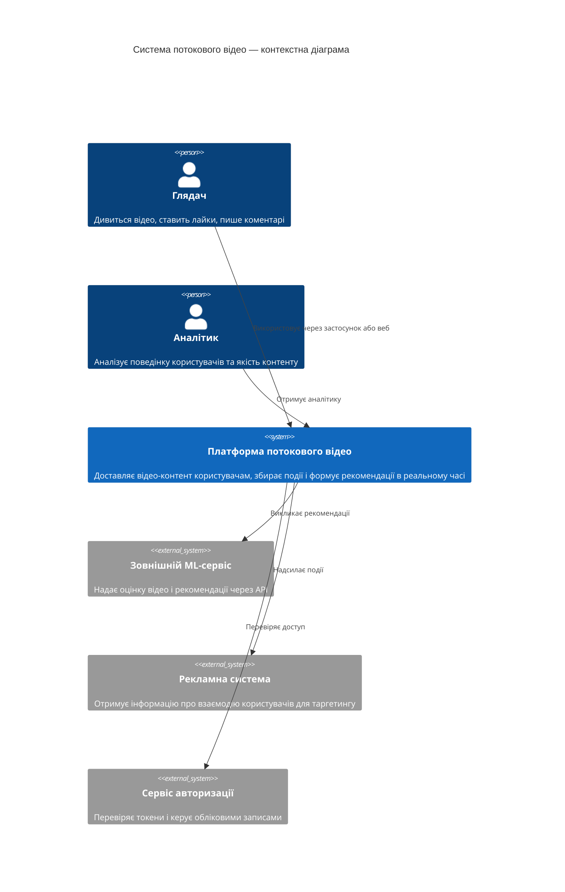
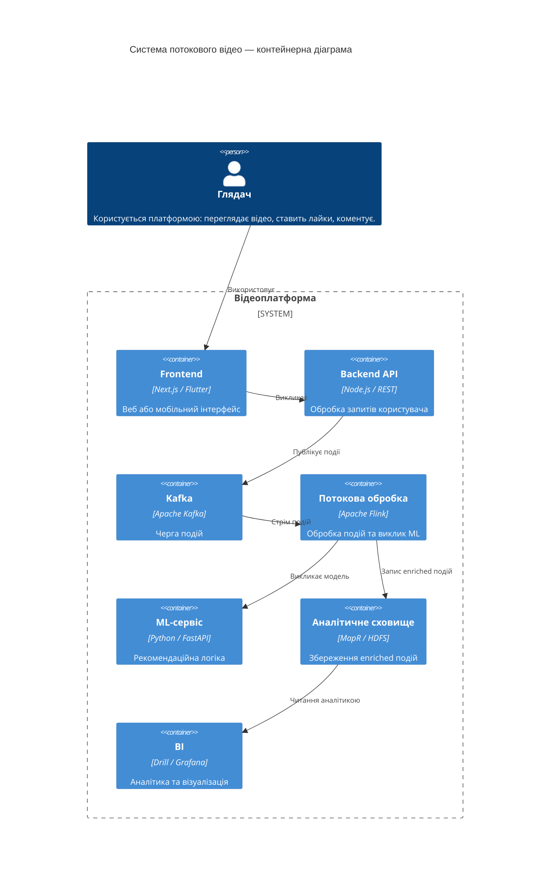
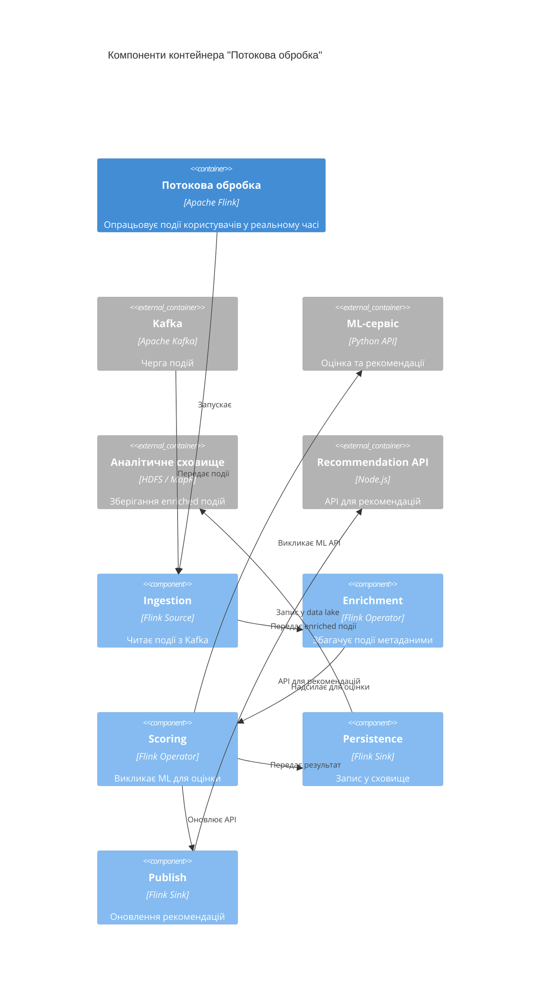

# 📺 C4-діаграми для платформи потокового відео

## 1. C4 Context Diagram

```mermaid
C4Context
title Система потокового відео — контекстна діаграма

Person(user, "Глядач", "Дивиться відео, ставить лайки, пише коментарі")
Person(admin, "Аналітик", "Аналізує поведінку користувачів та якість контенту")

System(system, "Платформа потокового відео", "Доставляє відео-контент користувачам, збирає події і формує рекомендації в реальному часі")

System_Ext(rec_engine, "Зовнішній ML-сервіс", "Надає оцінку відео і рекомендації через API")
System_Ext(ad_system, "Рекламна система", "Отримує інформацію про взаємодію користувачів для таргетингу")
System_Ext(auth_system, "Сервіс авторизації", "Перевіряє токени і керує обліковими записами")

Rel(user, system, "Використовує через застосунок або веб")
Rel(admin, system, "Отримує аналітику")
Rel(system, rec_engine, "Викликає рекомендації")
Rel(system, ad_system, "Надсилає події")
Rel(system, auth_system, "Перевіряє доступ")
```

## 2. C4 Container Diagram

```mermaid
C4Container
title Система потокового відео — контейнерна діаграма

Person(user, "Глядач", "Користується платформою: переглядає відео, ставить лайки, коментує.")

System_Boundary(system, "Відеоплатформа") {
    Container(frontend, "Frontend", "Next.js / Flutter", "Веб або мобільний інтерфейс")
    Container(api, "Backend API", "Node.js / REST", "Обробка запитів користувача")
    Container(kafka, "Kafka", "Apache Kafka", "Черга подій")
    Container(stream, "Потокова обробка", "Apache Flink", "Обробка подій та виклик ML")
    Container(ml, "ML-сервіс", "Python / FastAPI", "Рекомендаційна логіка")
    Container(store, "Аналітичне сховище", "MapR / HDFS", "Збереження enriched подій")
    Container(bi, "BI", "Drill / Grafana", "Аналітика та візуалізація")
}

Rel(user, frontend, "Використовує")
Rel(frontend, api, "Викликає")
Rel(api, kafka, "Публікує події")
Rel(kafka, stream, "Стрім подій")
Rel(stream, ml, "Викликає модель")
Rel(stream, store, "Запис enriched подій")
Rel(store, bi, "Читання аналітикою")
```

## 3. C4 Component Diagram (для контейнера “Потокова обробка”)

```mermaid
C4Component
title Компоненти контейнера "Потокова обробка"

Container(stream_proc, "Потокова обробка", "Apache Flink", "Опрацьовує події користувачів у реальному часі")

Container_Ext(kafka, "Kafka", "Apache Kafka", "Черга подій")
Container_Ext(ml_service, "ML-сервіс", "Python API", "Оцінка та рекомендації")
Container_Ext(data_lake, "Аналітичне сховище", "HDFS / MapR", "Зберігання enriched подій")
Container_Ext(api, "Recommendation API", "Node.js", "API для рекомендацій")

Component(ingestion, "Ingestion", "Flink Source", "Читає події з Kafka")
Component(enrichment, "Enrichment", "Flink Operator", "Збагачує події метаданими")
Component(scoring, "Scoring", "Flink Operator", "Викликає ML для оцінки")
Component(persistence, "Persistence", "Flink Sink", "Запис у сховище")
Component(publish, "Publish", "Flink Sink", "Оновлення рекомендацій")

Rel(kafka, ingestion, "Передає події")
Rel(stream_proc, ingestion, "Запускає")
Rel(ingestion, enrichment, "Передає enriched події")
Rel(enrichment, scoring, "Надсилає для оцінки")
Rel(scoring, ml_service, "Викликає ML API")
Rel(scoring, persistence, "Передає результат")
Rel(scoring, publish, "Оновлює API")
Rel(persistence, data_lake, "Запис у data lake")
Rel(publish, api, "API для рекомендацій")
```