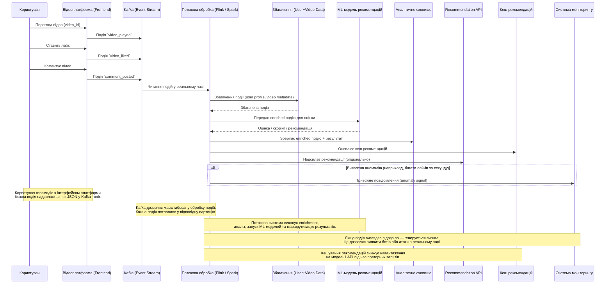

# Sequence діаграма Mermaid

```mermaid
sequenceDiagram
    participant User as Користувач
    participant Frontend as Відеоплатформа (Frontend)
    participant Kafka as Kafka (Event Stream)
    participant StreamProc as Потокова обробка (Flink / Spark)
    participant Enricher as Збагачення (User+Video Data)
    participant ML as ML-модель рекомендацій
    participant DB as Аналітичне сховище
    participant API as Recommendation API
    participant Cache as Кеш рекомендацій
    participant Monitor as Система моніторингу

    %% Події з фронтенду
    User->>Frontend: Перегляд відео (video_id)
    Frontend->>Kafka: Подія `video_played`

    User->>Frontend: Ставить лайк
    Frontend->>Kafka: Подія `video_liked`

    User->>Frontend: Коментує відео
    Frontend->>Kafka: Подія `comment_posted`

    %% Потокова обробка
    Kafka->>StreamProc: Читання подій у реальному часі
    StreamProc->>Enricher: Збагачення події (user profile, video metadata)
    Enricher-->>StreamProc: Збагачена подія

    StreamProc->>ML: Передає enriched подію для оцінки
    ML-->>StreamProc: Оцінка / скорінг / рекомендація

    StreamProc->>DB: Зберігає enriched подію + результат
    StreamProc->>Cache: Оновлює кеш рекомендацій
    StreamProc->>API: Надсилає рекомендації (опціонально)

    alt Виявлено аномалію (наприклад, багато лайків за секунду)
        StreamProc->>Monitor: Тривожне повідомлення (anomaly signal)
    end

    %% Коментарі
    Note over User,Frontend: Користувач взаємодіє з інтерфейсом платформи.<br/>Кожна подія надсилається як JSON у Kafka-топік.
    Note over Kafka,StreamProc: Kafka дозволяє масштабовану обробку подій.<br/>Кожна подія потрапляє у відповідну партицію.
    Note over StreamProc,ML: Потокова система виконує enrichment,<br/>аналіз, запуск ML-моделей та маршрутизацію результатів.
    Note over StreamProc,Monitor: Якщо подія виглядає підозріло — генерується сигнал.<br/>Це дозволяє виявити ботів або атаки в реальному часі.
    Note over StreamProc,Cache: Кешування рекомендацій знижує навантаження<br/>на модель і API під час повторних запитів.
```