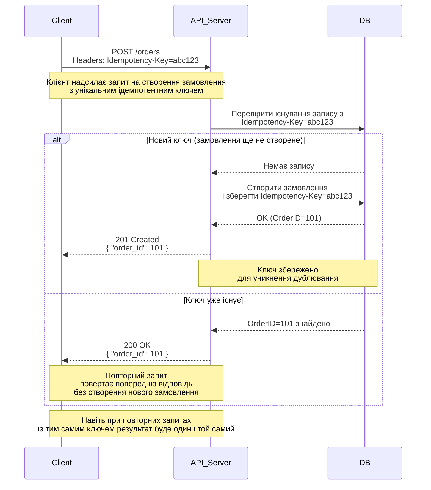

# Idempotency

```mermaid
sequenceDiagram
    participant Client
    participant API_Server
    participant DB

    Client->>API_Server: POST /orders<br/>Headers: Idempotency-Key=abc123
    Note over Client,API_Server: Клієнт надсилає запит на створення замовлення<br/>з унікальним ідемпотентним ключем

    API_Server->>DB: Перевірити існування запису з<br/>Idempotency-Key=abc123
    alt Новий ключ (замовлення ще не створене)
        DB-->>API_Server: Немає запису
        API_Server->>DB: Створити замовлення<br/>і зберегти Idempotency-Key=abc123
        DB-->>API_Server: OK (OrderID=101)
        API_Server-->>Client: 201 Created<br/>{ "order_id": 101 }
        Note over API_Server,DB: Ключ збережено<br/>для уникнення дублювання
    else Ключ уже існує
        DB-->>API_Server: OrderID=101 знайдено
        API_Server-->>Client: 200 OK<br/>{ "order_id": 101 }
        Note over API_Server,Client: Повторний запит<br/>повертає попередню відповідь<br/>без створення нового замовлення
    end

    Note over Client,API_Server: Навіть при повторних запитах<br/>із тим самим ключем результат буде один і той самий
```