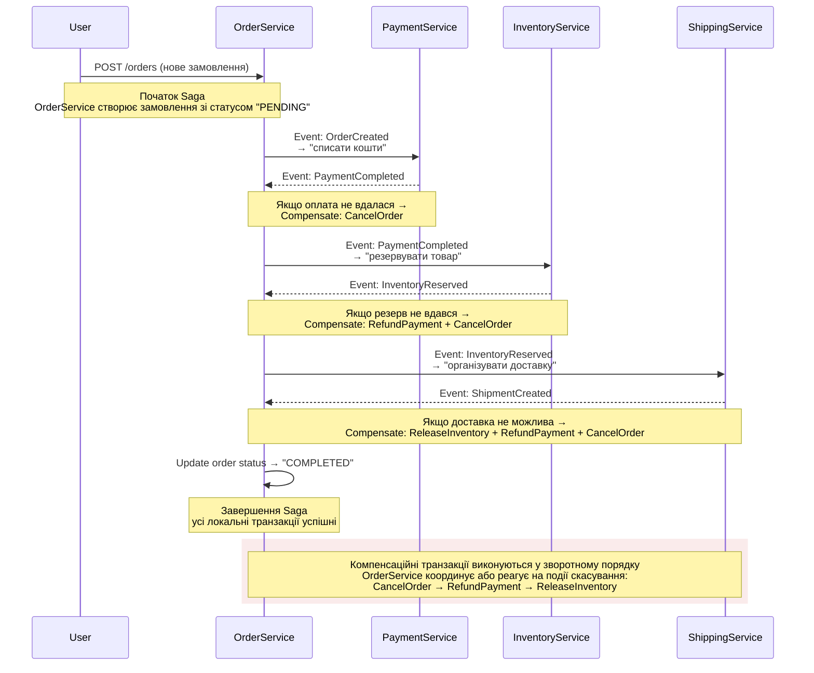

# SAGA Pattern

```mermaid
sequenceDiagram
    participant User
    participant OrderService
    participant PaymentService
    participant InventoryService
    participant ShippingService

    %% --- Створення замовлення ---
    User->>OrderService: POST /orders (нове замовлення)
    Note over User,OrderService: Початок Saga<br/>OrderService створює замовлення зі статусом "PENDING"

    OrderService->>PaymentService: Event: OrderCreated<br/>→ "списати кошти"
    PaymentService-->>OrderService: Event: PaymentCompleted
    Note over OrderService,PaymentService: Якщо оплата не вдалася →<br/>Compensate: CancelOrder

    %% --- Резерв товару ---
    OrderService->>InventoryService: Event: PaymentCompleted<br/>→ "резервувати товар"
    InventoryService-->>OrderService: Event: InventoryReserved
    Note over OrderService,InventoryService: Якщо резерв не вдався →<br/>Compensate: RefundPayment + CancelOrder

    %% --- Доставка ---
    OrderService->>ShippingService: Event: InventoryReserved<br/>→ "організувати доставку"
    ShippingService-->>OrderService: Event: ShipmentCreated
    Note over OrderService,ShippingService: Якщо доставка не можлива →<br/>Compensate: ReleaseInventory + RefundPayment + CancelOrder

    %% --- Завершення Saga ---
    OrderService->>OrderService: Update order status → "COMPLETED"
    Note over OrderService: Завершення Saga<br/>усі локальні транзакції успішні

    %% --- Компенсаційні сценарії ---
    rect rgb(250,235,235)
    Note over OrderService,ShippingService: Компенсаційні транзакції виконуються у зворотному порядку<br/>OrderService координує або реагує на події скасування:<br/>CancelOrder → RefundPayment → ReleaseInventory
    end
```